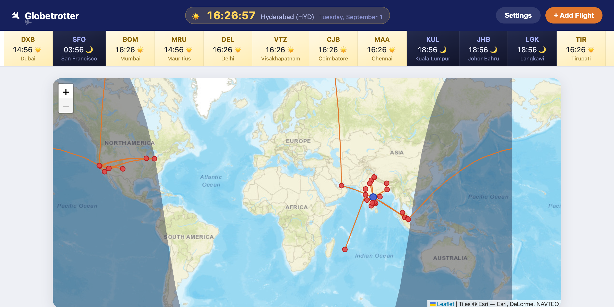
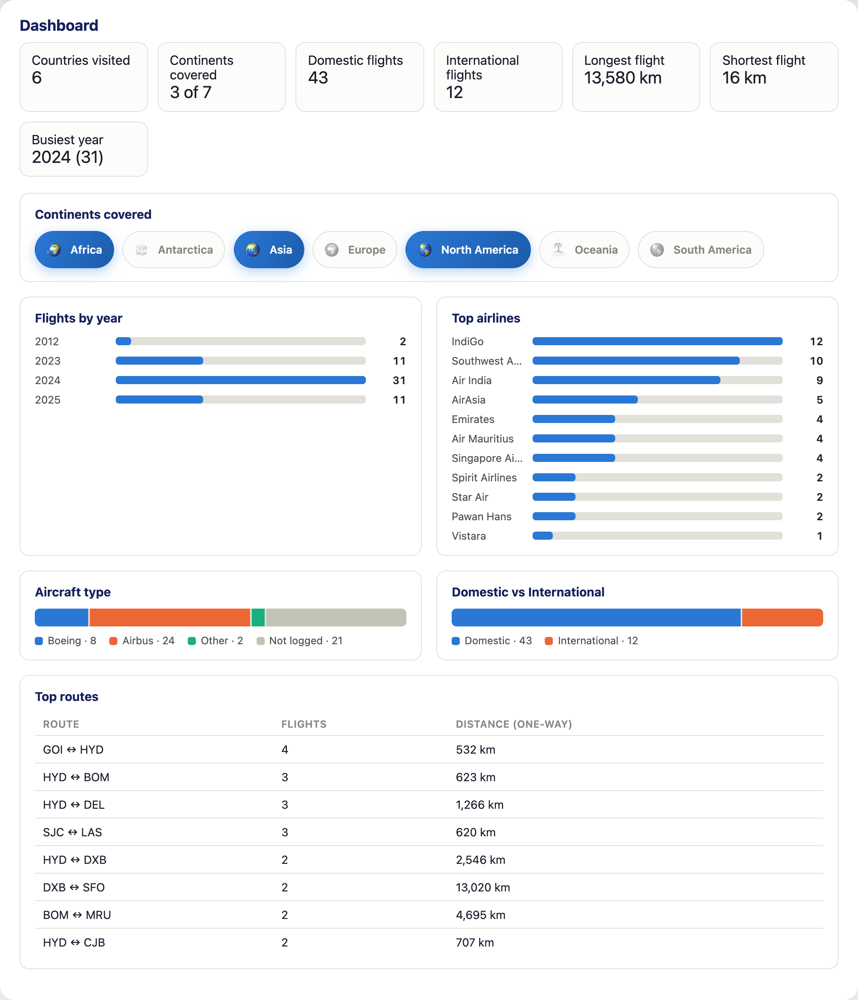
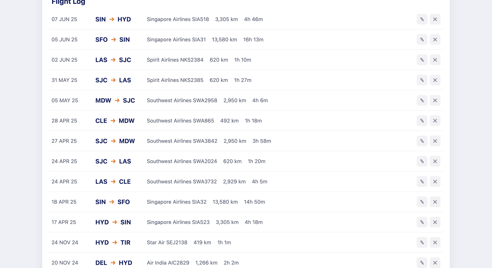

# ✈ Globetrotter

A personal flight-tracking web app, in the spirit of [Flighty](https://flighty.com/)'s
passport view — a live world map with a day/night terminator, per-airport local
clocks, a golden-ticket boarding pass summarizing your travel stats, and a stats
dashboard. Runs entirely in the browser: no backend, no build step, no account.

**Live: [globetrotter-ramesh.vercel.app](https://globetrotter-ramesh.vercel.app/)**



## Features

- **World map** — [Leaflet](https://leafletjs.com/) with great-circle flight
  routes, visited airports, and a live day/night terminator that recomputes
  every minute from the actual solar position.
- **Local clocks everywhere** — a big home-base clock in the header and a
  scrolling strip of clocks for every airport you've visited, each one styled
  sunlit-gold or starlit-navy depending on whether it's actually day or night
  there right now.
- **Boarding pass** — a golden-ticket-styled boarding pass summarizing your
  flight count, distance, flight time, airports, airlines, and the countries
  you've visited, with a foil shimmer and a cursor-tracking tilt.

  

- **Dashboard** — flights by year, top airlines, aircraft type (Boeing vs.
  Airbus vs. other), domestic vs. international split, continents covered,
  longest/shortest flight, busiest year, and top routes.

  

- **Flight log** — every flight you've added, with edit/delete, sorted newest
  first.

  

- **Import your own history** — drop in a [Flighty](https://flighty.com/) CSV
  export (Settings → Import Flighty CSV) and it parses dates, times,
  airlines, and aircraft directly; re-importing later updates existing
  flights instead of duplicating them.
- **Everything is local** — flights and settings live in your browser's
  `localStorage`. Nothing is sent anywhere. Export/import a JSON backup from
  Settings whenever you want a copy.

## Getting started

No build step, no dependencies to install. Either open it directly:

```bash
open index.html
```

...or serve it locally (recommended, avoids occasional `file://` quirks with
some browsers):

```bash
python3 -m http.server 8000
# then visit http://localhost:8000
```

On first-ever open in a browser with no saved flights, the app seeds itself
from `js/seedFlights.js` so it isn't empty. After that it's entirely driven
by what you add, edit, or import.

## Adding your own flights

- **One at a time** — click **+ Add Flight** and fill in the form. Give it a
  departure and arrival local time (not just a date) and the app computes
  exact flight duration across time zones for you.
- **In bulk** — Settings → **Import Flighty CSV**, pointing at a Flighty
  export. Unrecognized airport codes or airline codes are called out after
  import so you can add them.
- **Custom airports** — Settings → **Add a custom airport** if a code isn't
  in the built-in database (code, name, city, country, lat/lon, IANA
  timezone).

## Project structure

```
index.html            Page structure
css/style.css          All styling (boarding pass theme, dashboard, animations)
js/
  app.js                State, rendering, event handling — the app itself
  geo.js                Distance/great-circle math, solar terminator, timezone conversions
  airports.js            Built-in airport database (code, name, city, country, lat/lon, tz)
  airlines.js             ICAO airline code -> display name map (used by the CSV importer)
  continents.js            Country -> continent lookup, for the "continents covered" dashboard card
  csvImport.js            Flighty CSV export parser
  seedFlights.js           Bundled starter flight history (loaded once on a brand-new browser)
```

## Tech

Vanilla HTML/CSS/JS, [Leaflet](https://leafletjs.com/) for the map, Esri tiles
for the basemap (no API key required). No frameworks, no bundler, no package
manager — open the file and it runs.

## Privacy note

Everything lives in your browser's local storage — there's no server, no
analytics, no accounts. If you import a Flighty CSV export, note that
Flighty's export can include PNR/booking reference codes; this repo's
`.gitignore` excludes any `data/` directory for exactly that reason, so a raw
export never accidentally ends up committed.
